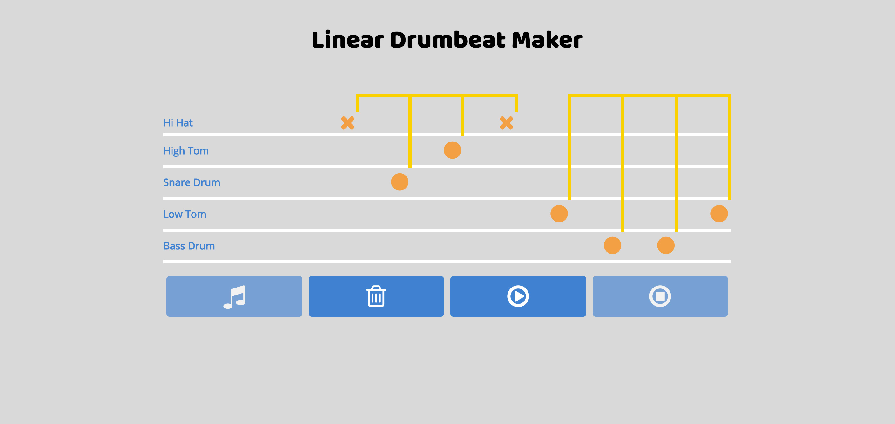

# Linear Drum Beats

## A simple app that creates and plays random linear drumbeats

### What is a Linear Drumbeat?

A Linear Drumbeat is a drumbeat where no two sound sources (drums and/or cymbals) strike at the same time. Linear drumbeats make for some of the most interesting and unusual drumbeats. I made this simple VueJS project to create random linear patterns that I normally wouldn't think of. The app creates and draws the beat using drum notation. Users can also hit the play button to hear how the beat would sound if played by a drummer.

[Live Demo](https://linear-drumbeats.herokuapp.com)

### Tech Used

- [VueJS](https://vuejs.org)
- SCSS
- Bootstrap 4
- HTML
- Gulp
- NodeJS
- Express

### Known Issues

Still working on getting sound to play on mobile.
